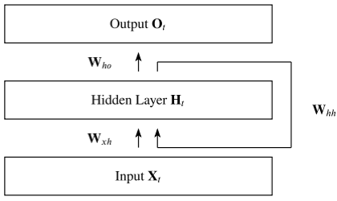

### Theory

Recurrent Neural Networks (RNNs) are a class of deep learning models specifically designed to process and model sequential data. RNNs originated as models inspired by biological neural systems and were initially explored within cognitive science and neuroscience. Over time, they were adopted by the machine learning community as powerful tools for modelling sequential data.

Unlike traditional feedforward neural networks, which assume inputs to be independent of one another, RNNs incorporate recurrent connections that allow information to persist across time steps. These recurrent connections can be visualized as cycles in the network architecture, enabling the model to retain and utilize information from previous inputs while processing the current input.

**Fig. 1.** Visualization of Recurrent Neural Network

*(Source: Robin M. Schmidt, "Recurrent Neural Networks (RNNs): A Gentle Introduction and Overview," arXiv:1912.05911v1, 2019)*

---

#### Mathematical Representation of Recurrent Neural Network

An RNN processes an input sequence one element at a time while maintaining a hidden state that captures information from previous time steps. At each time step $t$, the hidden state $H_t$ is updated using the current input $X_t$ and the hidden state from the previous time step $H_{t-1}$.

The hidden state update is given by:

$$H_t = \varphi_h\!\left(X_t W_{xh} + H_{t-1} W_{hh} + b_h\right)$$

where:

- $X_t$ is the input at time step $t$
- $H_t$ is the hidden state at time step $t$
- $W_{xh}$ is the input-to-hidden weight matrix
- $W_{hh}$ is the hidden-to-hidden (recurrent) weight matrix
- $b_h$ is the bias vector
- $\varphi_h(\cdot)$ is the activation function (typically $\tanh$ or ReLU)

The output $O_t$ at time step $t$ is computed as:

$$O_t = \varphi_o\!\left(H_t W_{ho} + b_o\right)$$

where:

- $W_{ho}$ is the hidden-to-output weight matrix
- $b_o$ is the output bias
- $\varphi_o(\cdot)$ is the output activation function (e.g. softmax for classification)

This process is repeated across all time steps, with the same parameters $\{W_{xh},\, W_{hh},\, W_{ho},\, b_h,\, b_o\}$ shared throughout the sequence, enabling the RNN to model temporal dependencies effectively.

---

#### Time Unrolling and Parameter Sharing

At an initial observation, the presence of cycles may appear to contradict the feedforward nature of neural networks, where computation flows strictly in one direction. However, RNNs resolve this apparent ambiguity through a precise formulation: the network is unrolled across time steps. In the unrolled representation, the RNN is transformed into a sequence of identical feedforward networks, one for each time step, where the same set of parameters is shared across all steps. This parameter sharing allows the model to generalize across sequences of varying lengths while maintaining temporal consistency.

---

#### Feedforward and Recurrent Connections

In an RNN, two types of connections operate simultaneously:

- **Standard (feedforward) connections** propagate activations from one layer to the next within the same time step.
- **Recurrent connections** transmit information from the hidden state $H_{t-1}$ at one time step to the hidden state $H_t$ at the next.

Through this mechanism, the hidden state acts as a form of memory, capturing contextual information from earlier elements in the sequence and influencing future predictions.

---

#### Backpropagation Through Time

The gradient computation in Recurrent Neural Networks involves performing a forward propagation pass through the unrolled network, followed by a backward propagation pass. Due to the inherently sequential nature of recurrent computation, the runtime complexity is $\mathcal{O}(\tau)$, where $\tau$ denotes the length of the input sequence. This computation cannot be parallelized across time steps, as each time step depends on the hidden state from the previous one.

During the forward pass, the hidden states at each time step must be stored so that they can be reused during the backward pass. As a result, the memory requirement is also $\mathcal{O}(\tau)$. The application of the backpropagation algorithm to the unrolled RNN computation graph is known as **Backpropagation Through Time (BPTT)**.

---

#### Merits of Recurrent Neural Networks

- **Sequential Memory:**
  RNNs retain information from previous inputs making them ideal for time-series predictions where past data is crucial. This makes them useful for tasks such as language modelling, where the meaning of a word depends on the context in which it appears.

- **Ability to handle variable-length sequences:**
  RNNs are designed to handle input sequences of variable length, which makes them well-suited for tasks such as speech recognition, natural language processing, and time-series analysis.

- **Parameter Sharing:**
  RNNs share the same set of parameters across all time steps, which reduces the number of parameters that need to be learnt and can lead to better generalization.

---

#### Demerits of Recurrent Neural Networks

- **Vanishing Gradient:**
  During backpropagation, gradients diminish as they pass through each time step, leading to minimal weight updates. This limits the RNN's ability to learn long-term dependencies which is crucial for tasks like language translation.

- **Exploding Gradient:**
  Sometimes gradients grow uncontrollably, causing excessively large weight updates that destabilize training. This is the problem of exploding gradients in RNNs.

- **Lack of Parallelism:**
  RNNs are inherently sequential, which makes it difficult to parallelize the computation. This limits the speed and scalability of the network compared to architectures like Transformers.